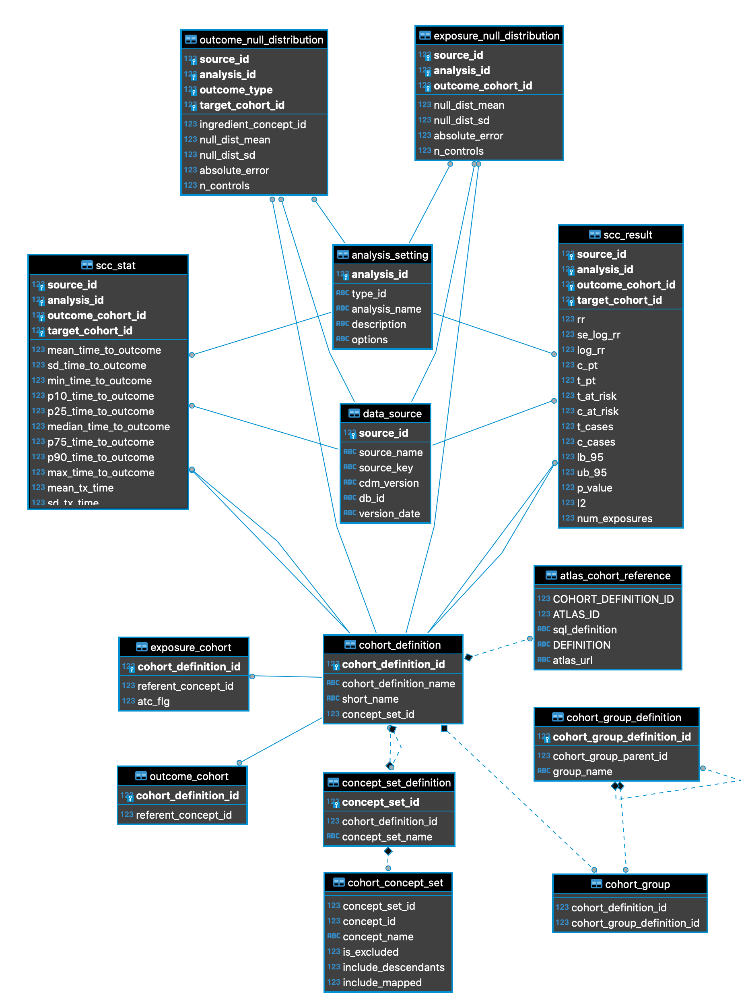
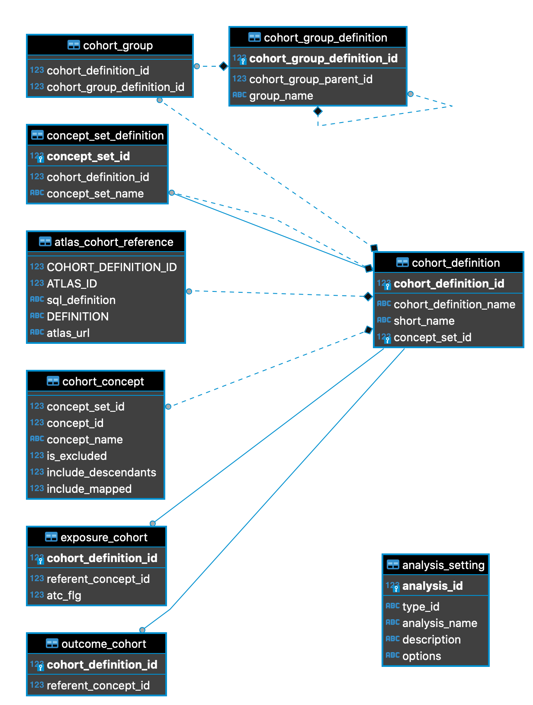

```{r, include = FALSE}
knitr::opts_chunk$set(
  collapse = TRUE,
  comment = "#>"
)
```
# Introduction and overall workflow
This document outlines the, high level, system design of the REWARD infrastructure as well as the R packages involved:
the `Reward` and `RewardExecutionPackage`.

# System outline

## Generating Cohort Reference Sets
After the REWARD schema is initiated on a central postgres instance, the next step is to produce a set of reference
cohorts.
There are currently three 'bulk' cohort types
In addition, custom phenotypes can be imported from any ATLAS/WebAPI instance via the ROhdsiWebApi package.

The database schema for REWARD is shown here.
{width=50%}

## Execution Package
As mentioned abover, the REWARD system consists of two major R Packages, the execution package and the main REWARD package.
The reason for this separation is to allow a streamlined package with minimal dependencies to run on an environment that
executes the code.

The DDL for cohort references imported into the CDM is described here:

{width=80%}

The distinction between other OHDSI packages and REWARD is that the data collection aspect of REWARD should not be
considered a 'study' in and of itself. The objective of the Execution environment is to collect data from CDMs, which
are possibly locked behind organisational firewalls, and transfer data to a centralised database where operations on the
aggregated data.

The steps that the execution package currently performs are as follows:

* Import Cohort reference sets from zipped contents
* Generate Outcome and Exposure Cohorts (bulk and custom phenotypes)
* Perform self-controlled cohort (SCCS) analysis across all outcome and exposure pairs
* Zip results
* Optionally, transfer data to main Reward database

(TODO) A further, optional step, that can be performed by the execution package is running the `CohortDiagnostics` OHDSI
package on subsets of generated cohorts.
This step would be extremely time-consuming for all cohorts (exposure/outcome pairs) and is likely completed as part
of generating a dashboard to verify the capture of phenotypes on the CDM.

## Data Aggregation steps
The data collected from the RAW CDMs is aggregated in a centralized postgres instance that stores all effect estimates
and associated statistics.
From here, data exploration and analysis can be performed by creating dashboards.
At a future date and experimental 'RewardExplorer' application will be build on top of the aggregated data that allows
the exploration of individual outcome-exposure pairs.

## Dashboard generation
The generation of REWARD Dashboards is a final step.
These dashboards are designed to create a subset of exposures with all outcomes, or a subset of outcomes with all
exposures.
Included in this step is performing calibration using the EmpiricalCalibration package.
Negative controls are selected automatically using the `CemConnector` package, which uses the OHDSI common evidence model
to find negative control cohorts amongst the Reward exposures and outcomes.
Meta-analysis is performed on the subset of CDMs selected in this analysis.

In order to make the dashboards portable, and stable, an Rshiny app is exported with a dedicated sqlite database that
includes all references and data.

